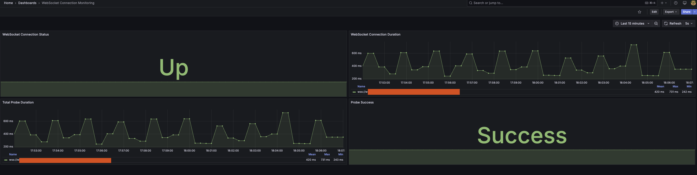

# WebSocket Exporter - Local Testing with Kind Cluster

This guide documents the process of setting up a local testing environment for the WebSocket Exporter using a kind Kubernetes cluster with Victoria Metrics Operator and Grafana.

## Overview

The WebSocket Exporter is a Prometheus exporter that monitors WebSocket connections by establishing connections to WebSocket endpoints and measuring connection success and latency. This document explains how to set up a complete local testing environment using:

- **kind**: A tool for running local Kubernetes clusters using Docker
- **Victoria Metrics Operator**: For monitoring and metrics collection
- **Grafana**: For visualization and dashboarding

## Prerequisites

- Docker
- kind
- kubectl
- Helm

## Step 1: Create a Kind Cluster

First, create a configuration file for the kind cluster:

```yaml
# kind-config.yaml
kind: Cluster
apiVersion: kind.x-k8s.io/v1alpha4
name: vm-cluster
nodes:
- role: control-plane
  extraPortMappings:
  - containerPort: 30001
    hostPort: 30001
    protocol: TCP
- role: worker
```

Create the cluster:

```bash
kind create cluster --config kind-config.yaml
```

## Step 2: Install Victoria Metrics Operator

Add the Victoria Metrics Helm repository:

```bash
helm repo add vm https://victoriametrics.github.io/helm-charts/
helm repo update
```

Create a namespace for Victoria Metrics:

```bash
kubectl create namespace victoria-metrics
```

Install the Victoria Metrics Operator:

```bash
helm install vm-operator vm/victoria-metrics-operator --namespace victoria-metrics
```

## Step 3: Deploy VMSingle for Metrics Storage

Create a VMSingle instance to store metrics:

```yaml
# vmsingle.yaml
apiVersion: operator.victoriametrics.com/v1beta1
kind: VMSingle
metadata:
  name: example-vmsingle
  namespace: victoria-metrics
spec:
  retentionPeriod: "1"
  removePvcAfterDelete: true
  storage:
    accessModes:
      - ReadWriteOnce
    resources:
      requests:
        storage: 1Gi
  extraArgs:
    dedup.minScrapeInterval: 30s
  resources:
    requests:
      memory: "64Mi"
      cpu: "100m"
    limits:
      memory: "128Mi"
      cpu: "200m"
```

Create a service to expose VMSingle:

```yaml
# vmsingle-service.yaml
apiVersion: v1
kind: Service
metadata:
  name: vmsingle-service
  namespace: victoria-metrics
spec:
  selector:
    app.kubernetes.io/name: vmsingle
    app.kubernetes.io/instance: example-vmsingle
  type: NodePort
  ports:
  - name: http
    port: 8428
    targetPort: 8428
    nodePort: 30001
```

Apply the configurations:

```bash
kubectl apply -f vmsingle.yaml
kubectl apply -f vmsingle-service.yaml
```

## Step 4: Build and Deploy the WebSocket Exporter

Build the WebSocket Exporter Docker image:

```bash
docker build -t websocket-exporter:latest .
```

Load the image into the kind cluster:

```bash
kind load docker-image websocket-exporter:latest --name vm-cluster
```

Create a deployment for the WebSocket Exporter:

```yaml
# websocket-exporter-deployment.yaml
apiVersion: apps/v1
kind: Deployment
metadata:
  name: websocket-exporter
  namespace: victoria-metrics
  labels:
    app: websocket-exporter
spec:
  replicas: 1
  selector:
    matchLabels:
      app: websocket-exporter
  template:
    metadata:
      labels:
        app: websocket-exporter
    spec:
      containers:
      - name: websocket-exporter
        image: websocket-exporter:latest
        imagePullPolicy: IfNotPresent
        ports:
        - containerPort: 9095
          name: http
        resources:
          limits:
            cpu: 200m
            memory: 256Mi
          requests:
            cpu: 100m
            memory: 128Mi
---
apiVersion: v1
kind: Service
metadata:
  name: websocket-exporter
  namespace: victoria-metrics
spec:
  selector:
    app: websocket-exporter
  ports:
  - port: 9095
    targetPort: 9095
    name: http
  type: ClusterIP
```

Apply the deployment:

```bash
kubectl apply -f websocket-exporter-deployment.yaml
```

## Step 5: Configure VMAgent for Metrics Collection

Create a VMAgent to collect metrics:

```yaml
# vmagent.yaml
apiVersion: operator.victoriametrics.com/v1beta1
kind: VMAgent
metadata:
  name: vmagent
  namespace: victoria-metrics
spec:
  replicaCount: 1
  remoteWrite:
    - url: "http://vmsingle-example-vmsingle.victoria-metrics.svc:8429/api/v1/write"
  selectAllByDefault: true
  serviceScrapeNamespaceSelector: {}
  podScrapeNamespaceSelector: {}
  probeNamespaceSelector: {}
  staticScrapeNamespaceSelector: {}
  resources:
    limits:
      cpu: 200m
      memory: 256Mi
    requests:
      cpu: 100m
      memory: 128Mi
```

Create a VMServiceScrape to tell the VMAgent to scrape the WebSocket Exporter:

```yaml
# vmservicescrape.yaml
apiVersion: operator.victoriametrics.com/v1beta1
kind: VMServiceScrape
metadata:
  name: websocket-exporter
  namespace: victoria-metrics
spec:
  selector:
    matchLabels:
      app: websocket-exporter
  endpoints:
  - port: http
    path: /metrics
    interval: 15s
```

Apply the configurations:

```bash
kubectl apply -f vmagent.yaml
kubectl apply -f vmservicescrape.yaml
```

## Step 6: Configure VMProbe for WebSocket Monitoring

Create a VMProbe to monitor WebSocket endpoints:

```yaml
# vmprobe-config.yaml
apiVersion: operator.victoriametrics.com/v1beta1
kind: VMProbe
metadata:
  name: websocket-connection-probe
  namespace: victoria-metrics
  labels:
    app.kubernetes.io/name: websocket-connection-probe
spec:
  jobName: websocket-connection-monitoring
  vmProberSpec:
    url: websocket-exporter.victoria-metrics.svc:9095
    path: /probe
  interval: 30s
  targets:
    staticConfig:
      targets:
      - wss://websocket-endpoint/token
      labels:
        service: blockchain-nodes
```

Apply the VMProbe configuration:

```bash
kubectl apply -f vmprobe-config.yaml
```

## Step 7: Deploy Grafana for Visualization

Create a Grafana deployment:

```yaml
# grafana.yaml
apiVersion: apps/v1
kind: Deployment
metadata:
  name: grafana
  namespace: victoria-metrics
  labels:
    app: grafana
spec:
  replicas: 1
  selector:
    matchLabels:
      app: grafana
  template:
    metadata:
      labels:
        app: grafana
    spec:
      containers:
      - name: grafana
        image: grafana/grafana:latest
        ports:
        - containerPort: 3000
          name: http
        env:
        - name: GF_SECURITY_ADMIN_USER
          value: admin
        - name: GF_SECURITY_ADMIN_PASSWORD
          value: admin
        - name: GF_INSTALL_PLUGINS
          value: "grafana-clock-panel,grafana-simple-json-datasource"
        volumeMounts:
        - name: grafana-datasources
          mountPath: /etc/grafana/provisioning/datasources
        - name: grafana-dashboards-config
          mountPath: /etc/grafana/provisioning/dashboards
        - name: grafana-dashboards
          mountPath: /var/lib/grafana/dashboards
        resources:
          limits:
            cpu: 200m
            memory: 256Mi
          requests:
            cpu: 100m
            memory: 128Mi
      volumes:
      - name: grafana-datasources
        configMap:
          name: grafana-datasources
      - name: grafana-dashboards-config
        configMap:
          name: grafana-dashboards-config
      - name: grafana-dashboards
        configMap:
          name: grafana-dashboards
---
apiVersion: v1
kind: Service
metadata:
  name: grafana
  namespace: victoria-metrics
spec:
  selector:
    app: grafana
  type: NodePort
  ports:
  - name: http
    port: 3000
    targetPort: 3000
    nodePort: 30002
```

Create a datasource configuration for Grafana:

```yaml
# grafana-datasource.yaml
apiVersion: v1
kind: ConfigMap
metadata:
  name: grafana-datasources
  namespace: victoria-metrics
data:
  datasources.yaml: |-
    apiVersion: 1
    datasources:
    - name: VictoriaMetrics
      type: prometheus
      url: http://vmsingle-example-vmsingle.victoria-metrics.svc:8429
      access: proxy
      isDefault: true
```

Create a dashboard configuration for Grafana:



```yaml
# grafana-dashboard-config.yaml
apiVersion: v1
kind: ConfigMap
metadata:
  name: grafana-dashboards-config
  namespace: victoria-metrics
data:
  dashboards.yaml: |-
    apiVersion: 1
    providers:
    - name: 'default'
      orgId: 1
      folder: ''
      type: file
      disableDeletion: false
      updateIntervalSeconds: 10
      options:
        path: /var/lib/grafana/dashboards
```

Create a WebSocket monitoring dashboard:

```yaml
# grafana-dashboard.yaml
apiVersion: v1
kind: ConfigMap
metadata:
  name: grafana-dashboards
  namespace: victoria-metrics
data:
  websocket-dashboard.json: |-
    {
      "annotations": {
        "list": [
          {
            "builtIn": 1,
            "datasource": {
              "type": "grafana",
              "uid": "-- Grafana --"
            },
            "enable": true,
            "hide": true,
            "iconColor": "rgba(0, 211, 255, 1)",
            "name": "Annotations & Alerts",
            "type": "dashboard"
          }
        ]
      },
      "editable": true,
      "fiscalYearStartMonth": 0,
      "graphTooltip": 0,
      "id": 1,
      "links": [],
      "liveNow": false,
      "panels": [
        {
          "datasource": {
            "type": "prometheus",
            "uid": "VictoriaMetrics"
          },
          "fieldConfig": {
            "defaults": {
              "color": {
                "mode": "thresholds"
              },
              "mappings": [
                {
                  "options": {
                    "0": {
                      "color": "red",
                      "index": 0,
                      "text": "Down"
                    },
                    "1": {
                      "color": "green",
                      "index": 1,
                      "text": "Up"
                    }
                  },
                  "type": "value"
                }
              ],
              "thresholds": {
                "mode": "absolute",
                "steps": [
                  {
                    "color": "red",
                    "value": null
                  },
                  {
                    "color": "green",
                    "value": 1
                  }
                ]
              },
              "unit": "none"
            },
            "overrides": []
          },
          "gridPos": {
            "h": 8,
            "w": 12,
            "x": 0,
            "y": 0
          },
          "id": 1,
          "options": {
            "colorMode": "value",
            "graphMode": "area",
            "justifyMode": "auto",
            "orientation": "auto",
            "reduceOptions": {
              "calcs": [
                "lastNotNull"
              ],
              "fields": "",
              "values": false
            },
            "textMode": "auto"
          },
          "title": "WebSocket Connection Status",
          "type": "stat",
          "targets": [
            {
              "expr": "probe_websocket_up",
              "legendFormat": "{{instance}}"
            }
          ]
        },
        {
          "datasource": {
            "type": "prometheus",
            "uid": "VictoriaMetrics"
          },
          "fieldConfig": {
            "defaults": {
              "color": {
                "mode": "palette-classic"
              },
              "custom": {
                "axisCenteredZero": false,
                "axisColorMode": "text",
                "axisLabel": "",
                "axisPlacement": "auto",
                "barAlignment": 0,
                "drawStyle": "line",
                "fillOpacity": 10,
                "gradientMode": "none",
                "hideFrom": {
                  "legend": false,
                  "tooltip": false,
                  "viz": false
                },
                "lineInterpolation": "linear",
                "lineWidth": 1,
                "pointSize": 5,
                "scaleDistribution": {
                  "type": "linear"
                },
                "showPoints": "auto",
                "spanNulls": false,
                "stacking": {
                  "group": "A",
                  "mode": "none"
                },
                "thresholdsStyle": {
                  "mode": "off"
                }
              },
              "mappings": [],
              "thresholds": {
                "mode": "absolute",
                "steps": [
                  {
                    "color": "green",
                    "value": null
                  }
                ]
              },
              "unit": "s"
            },
            "overrides": []
          },
          "gridPos": {
            "h": 8,
            "w": 12,
            "x": 12,
            "y": 0
          },
          "id": 2,
          "options": {
            "legend": {
              "calcs": [
                "mean",
                "max",
                "min"
              ],
              "displayMode": "table",
              "placement": "bottom",
              "showLegend": true
            },
            "tooltip": {
              "mode": "single",
              "sort": "none"
            }
          },
          "title": "WebSocket Connection Duration",
          "type": "timeseries",
          "targets": [
            {
              "expr": "probe_websocket_connection_duration_seconds",
              "legendFormat": "{{instance}}"
            }
          ]
        },
        {
          "datasource": {
            "type": "prometheus",
            "uid": "VictoriaMetrics"
          },
          "fieldConfig": {
            "defaults": {
              "color": {
                "mode": "palette-classic"
              },
              "custom": {
                "axisCenteredZero": false,
                "axisColorMode": "text",
                "axisLabel": "",
                "axisPlacement": "auto",
                "barAlignment": 0,
                "drawStyle": "line",
                "fillOpacity": 10,
                "gradientMode": "none",
                "hideFrom": {
                  "legend": false,
                  "tooltip": false,
                  "viz": false
                },
                "lineInterpolation": "linear",
                "lineWidth": 1,
                "pointSize": 5,
                "scaleDistribution": {
                  "type": "linear"
                },
                "showPoints": "auto",
                "spanNulls": false,
                "stacking": {
                  "group": "A",
                  "mode": "none"
                },
                "thresholdsStyle": {
                  "mode": "off"
                }
              },
              "mappings": [],
              "thresholds": {
                "mode": "absolute",
                "steps": [
                  {
                    "color": "green",
                    "value": null
                  }
                ]
              },
              "unit": "s"
            },
            "overrides": []
          },
          "gridPos": {
            "h": 8,
            "w": 12,
            "x": 0,
            "y": 8
          },
          "id": 3,
          "options": {
            "legend": {
              "calcs": [
                "mean",
                "max",
                "min"
              ],
              "displayMode": "table",
              "placement": "bottom",
              "showLegend": true
            },
            "tooltip": {
              "mode": "single",
              "sort": "none"
            }
          },
          "title": "Total Probe Duration",
          "type": "timeseries",
          "targets": [
            {
              "expr": "probe_duration_seconds",
              "legendFormat": "{{instance}}"
            }
          ]
        },
        {
          "datasource": {
            "type": "prometheus",
            "uid": "VictoriaMetrics"
          },
          "fieldConfig": {
            "defaults": {
              "color": {
                "mode": "thresholds"
              },
              "mappings": [
                {
                  "options": {
                    "0": {
                      "color": "red",
                      "index": 0,
                      "text": "Failed"
                    },
                    "1": {
                      "color": "green",
                      "index": 1,
                      "text": "Success"
                    }
                  },
                  "type": "value"
                }
              ],
              "thresholds": {
                "mode": "absolute",
                "steps": [
                  {
                    "color": "red",
                    "value": null
                  },
                  {
                    "color": "green",
                    "value": 1
                  }
                ]
              },
              "unit": "none"
            },
            "overrides": []
          },
          "gridPos": {
            "h": 8,
            "w": 12,
            "x": 12,
            "y": 8
          },
          "id": 4,
          "options": {
            "colorMode": "value",
            "graphMode": "area",
            "justifyMode": "auto",
            "orientation": "auto",
            "reduceOptions": {
              "calcs": [
                "lastNotNull"
              ],
              "fields": "",
              "values": false
            },
            "textMode": "auto"
          },
          "title": "Probe Success",
          "type": "stat",
          "targets": [
            {
              "expr": "probe_success",
              "legendFormat": "{{instance}}"
            }
          ]
        }
      ],
      "refresh": "5s",
      "schemaVersion": 38,
      "style": "dark",
      "tags": [],
      "templating": {
        "list": []
      },
      "time": {
        "from": "now-15m",
        "to": "now"
      },
      "title": "WebSocket Connection Monitoring",
      "uid": "websocket-monitoring",
      "version": 1
    }
```

Apply all Grafana configurations:

```bash
kubectl apply -f grafana-datasource.yaml
kubectl apply -f grafana-dashboard-config.yaml
kubectl apply -f grafana-dashboard.yaml
kubectl apply -f grafana.yaml
```

## Step 8: Access the Monitoring Stack

Port-forward the services to access them locally:

```bash
# Access Victoria Metrics
kubectl port-forward svc/vmsingle-example-vmsingle -n victoria-metrics 8429:8429

# Access Grafana
kubectl port-forward svc/grafana -n victoria-metrics 3000:3000
```

Access Grafana at <http://localhost:3000> with the following credentials:

- Username: admin
- Password: admin

## Monitoring Results

After setting up the environment, you can observe the following metrics in Grafana:

1. **WebSocket Connection Status**: Shows if the WebSocket connection is up or down
2. **WebSocket Connection Duration**: Shows the time taken to establish the WebSocket connection
3. **Total Probe Duration**: Shows the total time taken for the probe to complete
4. **Probe Success**: Shows if the overall probe was successful

## Troubleshooting

### Common Issues

1. **ImagePullBackOff Error**:
   - Solution: Make sure to load the Docker image into the kind cluster using `kind load docker-image`

2. **VMAgent Not Discovering Targets**:
   - Solution: Check the VMServiceScrape and VMProbe configurations, and ensure the selectors match the service labels

3. **No Metrics in Grafana**:
   - Solution: Verify that the datasource is correctly configured and that the VMAgent is successfully collecting metrics

### Useful Commands

```bash
# Check pod status
kubectl get pods -n victoria-metrics

# Check logs for a specific pod
kubectl logs -n victoria-metrics <pod-name>

# Check VMAgent configuration
kubectl describe vmagent -n victoria-metrics vmagent

# Check VMProbe configuration
kubectl describe vmprobe -n victoria-metrics websocket-connection-probe

# Query metrics directly from Victoria Metrics
curl "http://localhost:8429/api/v1/query?query=probe_websocket_up"
```

## Conclusion

This setup provides a complete local testing environment for the WebSocket Exporter using kind, Victoria Metrics Operator, and Grafana. It allows you to monitor WebSocket connections, measure connection latency, and visualize the metrics in a Grafana dashboard.

The environment is fully containerized and can be easily set up on any machine with Docker installed, making it ideal for development and testing purposes.
